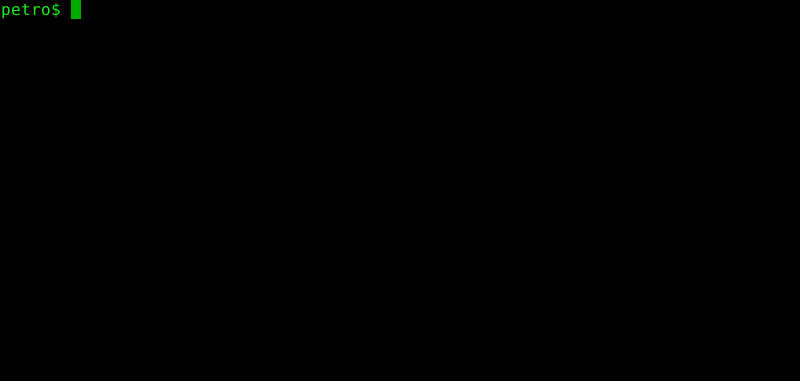

=====
petro
=====

|Linux make-specs| |Windows make-specs| |MacOS make-specs| |Linux CMake| |Windows CMake| |MacOS CMake| |Valgrind| |No Assertions| |Clang Format| |Cppcheck|

.. |Linux make-specs| image:: https://github.com/steinwurf/petro/actions/workflows/linux_mkspecs.yml/badge.svg
   :target: https://github.com/steinwurf/petro/actions/workflows/linux_mkspecs.yml
   
.. |Windows make-specs| image:: https://github.com/steinwurf/petro/actions/workflows/windows_mkspecs.yml/badge.svg
   :target: https://github.com/steinwurf/petro/actions/workflows/windows_mkspecs.yml

.. |MacOS make-specs| image:: https://github.com/steinwurf/petro/actions/workflows/macos_mkspecs.yml/badge.svg
   :target: https://github.com/steinwurf/petro/actions/workflows/macos_mkspecs.yml
   
.. |Linux CMake| image:: https://github.com/steinwurf/petro/actions/workflows/linux_cmake.yml/badge.svg
   :target: https://github.com/steinwurf/petro/actions/workflows/linux_cmake.yml

.. |Windows CMake| image:: https://github.com/steinwurf/petro/actions/workflows/windows_cmake.yml/badge.svg
   :target: https://github.com/steinwurf/petro/actions/workflows/windows_cmake.yml
   
.. |MacOS CMake| image:: https://github.com/steinwurf/petro/actions/workflows/macos_cmake.yml/badge.svg
   :target: https://github.com/steinwurf/petro/actions/workflows/macos_cmake.yml

.. |Clang Format| image:: https://github.com/steinwurf/petro/actions/workflows/clang-format.yml/badge.svg
   :target: https://github.com/steinwurf/petro/actions/workflows/clang-format.yml

.. |No Assertions| image:: https://github.com/steinwurf/petro/actions/workflows/nodebug.yml/badge.svg
   :target: https://github.com/steinwurf/petro/actions/workflows/nodebug.yml

.. |Valgrind| image:: https://github.com/steinwurf/petro/actions/workflows/valgrind.yml/badge.svg
   :target: https://github.com/steinwurf/petro/actions/workflows/valgrind.yml

.. |Cppcheck| image:: https://github.com/steinwurf/petro/actions/workflows/cppcheck.yml/badge.svg
   :target: https://github.com/steinwurf/petro/actions/workflows/cppcheck.yml

petro is an mp4 parser which allows you to extract all kinds of information.

The implementation is based on `ISO/IEC 14496-12 <http://www.iso.org/iso/catalogue_detail.htm?csnumber=61988>`_,
link to the `2015 revision <http://standards.iso.org/ittf/PubliclyAvailableStandards/c068960_ISO_IEC_14496-12_2015.zip>`_

Usage
=====

More examples of how to use petro is located in the examples folder.

Building shared library
-----------------------

Configure with -fPIC to enable building a shared lib::

    ./waf configure ... --cxxflags=-fPIC

The `-fPIC` flag is needed to build a shared library read more about that here:
http://stackoverflow.com/a/19768349

Use as Dependency in CMake
--------------------------

To depend on this project when using the CMake build system, add the following
in your CMake build script:

::

   add_subdirectory("/path/to/petro" petro)
   target_link_libraries(<my_target> steinwurf::petro)

Where ``<my_target>`` is replaced by your target.
